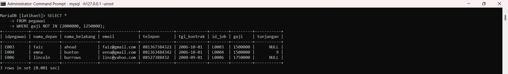
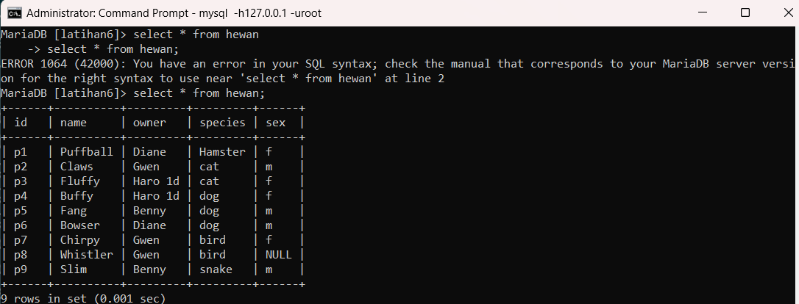
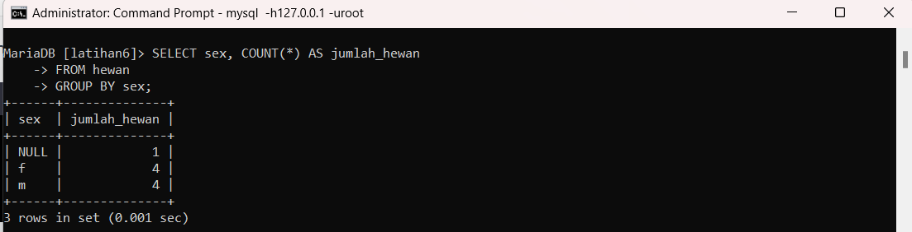
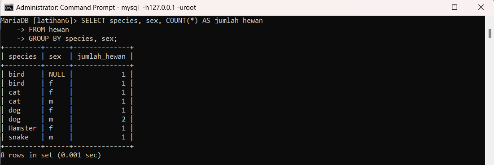

## SQL Praktikum 4 

Nama: Alifia Ananda Putri

Nim: 312210168

Kelas: TI.22.A2

## Query Filtering

Query filtering mengacu pada proses memfilter atau membatasi data yang diambil dari database berdasarkan kriteria tertentu. Dalam konteks basis data, query filtering melibatkan penggunaan klausa "WHERE" dalam perintah SQL untuk mengatur kondisi atau kriteria yang harus dipenuhi oleh data yang ingin diambil.

Dengan menggunakan query filtering, Anda dapat menentukan kondisi seperti kesamaan, ketidaksamaan, rentang nilai, atau kombinasi kondisi lainnya untuk memilih subset data yang relevan dari tabel. Ini membantu Anda memfokuskan pada data yang spesifik atau memenuhi persyaratan tertentu.

## Tugas Praktikum 1

Sebelumnya buatlah tabel pegawai seperti gambar berikut

1. Tampilkan pegawai yang gajinya bukan 2.000.000 dan 1.250.000!

perintah:

SELECT * FROM pegawai WHERE gaji <> 2000000 AND gaji <> 1250000;

Output:

2. Tampilkan pegawai yang tunjangannya NUL!

perintah:

SELECT * FROM pegawai WHERE tunjangan IS NULL;

output:

3. Tampilkan pegawai yang tunjangannya tidak NULL!

Perintah:

SELECT * FROM pegawai WHERE tunjangan IS NOT NULL;

Output:

4. Tampilkan/hitung jumlah baris/record tabel pegawai!

Perintah:

SELECT COUNT(*) AS jumlah_baris FROM pegawai;

Output:

5. Tampilkan/hitung jumlah total gaji di tabel pegawai!

Perintah:

SELECT SUM(gaji) AS total_gaji FROM pegawai;

Output:

6. Tampilkan/hitung jumlah rata-rata gaji pegawai!

Perintah:

SELECT AVG(gaji) AS rata_gaji FROM pegawai

Output:

7. Tampilkan gaji terkecil!

Perintah:

SELECT MIN(gaji) AS gaji_terkecil FROM pegawai;

Output:

8. Tampilkan gaji terbesar!

Perintah:

SELECT MAX(gaji) AS gaji_terbesar FROM pegawai;

Output:

## Tugas Praktikum 2

Sebelumnya buatlah tabel pegawai seperti gambar berikut

1. Tampilkan jumlah hewan yang dimiliki setiap owner!

Perintah:

SELECT owner, COUNT(*) AS jumlah_hewan FROM hewan GROUP BY owner;

Output:

2. Tampilkan jumlah hewan berdasarkan spesies!

Perintah:

SELECT species, COUNT(*) AS jumlah_hewan FROM hewan GROUP BY species;

Output:

3. Tampilkan jumlah hewan berdasarkan jenis kelamin!

Perintah:

SELECT sex, COUNT(*) AS jumlah_hewan FROM hewan GROUP BY sex;

Output:

4. Tampilkan jumlah hewan berdasarkan spesies dan jenis kelamin!

Perintah:

SELECT species,sex, COUNT(*) AS jumlah_hewan FROM hewan GROUP BY species,sex;

Output:

5. Tampilkan jumlah hewan berdasarkan spesies (cat dan dog saja) dan jenis kelamin!

Perintah:

SELECT species,sex, COUNT(*) AS jumlah_hewan FROM hewan
WHERE species IN('Cat','Dog')
GROUP BY species,sex;

Output:

6. Tampilkan jumlah hewan berdasarkan jenis kelamin yang diketahui saja!

Perintah:

SELECT sex, COUNT(*) AS jumlah_hewan FROM hewan
WHERE sex IN('f','m')
GROUP BY sex;

Output:

## Evaluasi dan Pertanyaan

. Tulis semua perintah-perintah SQL percobaan di atas besarta outputnya!

. Beri kesimpulan anda!

## Kesimpulan

Query filtering adalah proses menyaring atau memfilter data dari basis data berdasarkan kriteria tertentu menggunakan perintah query dalam bahasa SQL. Tujuan utama dari query filtering adalah membatasi atau mengambil subset data yang sesuai dengan kondisi yang ditentukan.
Dengan menggunakan query filtering, Anda dapat menentukan berbagai jenis kondisi seperti kesamaan (equal), ketidaksamaan (not equal), rentang nilai (range), kondisi logis (AND, OR), atau kombinasi kondisi lainnya. Dengan mengatur kondisi yang sesuai, Anda dapat mengambil hanya data yang relevan atau yang memenuhi persyaratan tertentu.